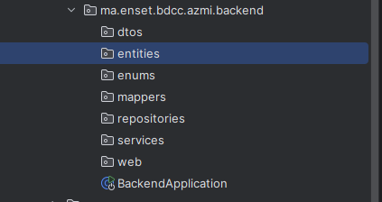
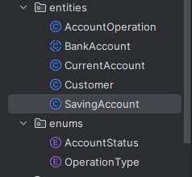
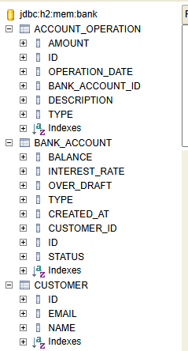
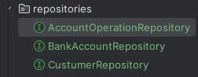
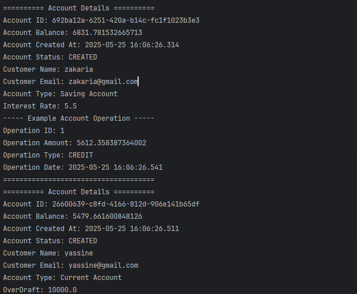
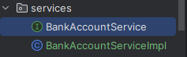
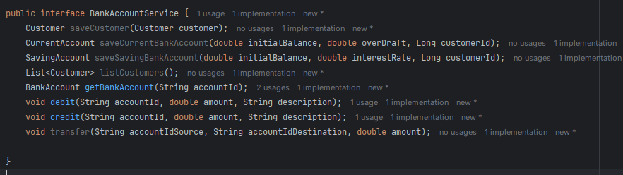
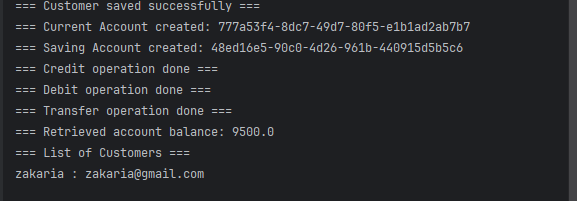

# Digital Banking App Backend

This project is a **Spring Boot** backend for a digital banking application. It provides RESTful APIs for core banking operations and is designed to integrate with Angular-based client application.

## Application Architecture

## Entity Design and Relationships

### Database Tables Overview

### Interface JPA Repositories

## Testing the DAO Layer

## Service Layer Implementation

### Interface BankAccountService

### Test Service layer

